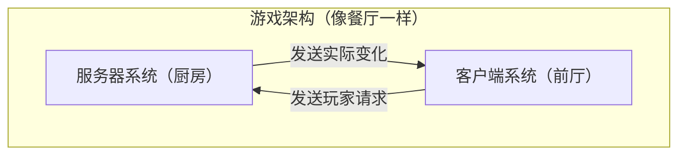
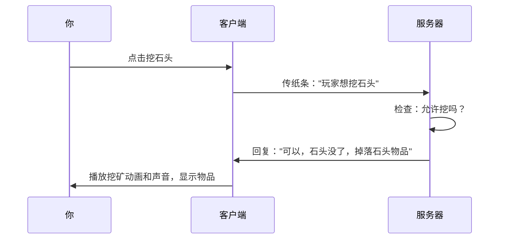
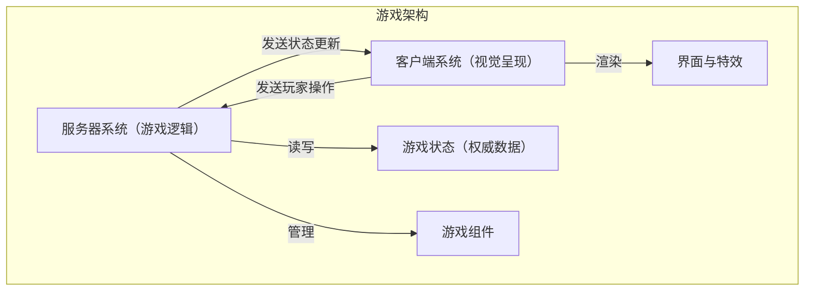
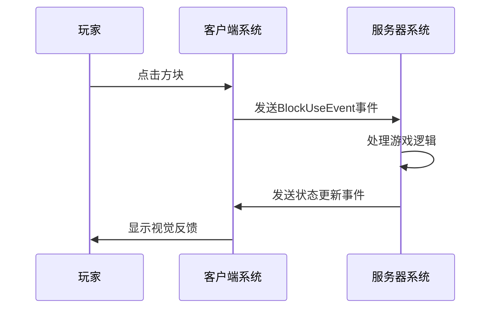

### 🧩 为什么需要两个系统（System）？用餐厅来理解！

想象一下游戏就像一家餐厅：
- **服务器系统** = 厨房（决定食物实际内容）
- **客户端系统** = 餐厅前厅（呈现给顾客看到的体验）



### 👨‍🍳 服务器系统：游戏的"厨房"

- **职责**: 决定游戏中真正发生了什么
- **简单理解**: 
  - 计算伤害（怪物真的死了吗？）
  - 决定方块是否被破坏
  - 控制物品掉落
  - 存储真实的游戏数据

### 👨‍💼 客户端系统：游戏的"前厅"

- **职责**: 让玩家看到并互动
- **简单理解**:
  - 显示画面和声音
  - 处理你的鼠标点击和按键
  - 播放爆炸、火焰等特效
  - 展示菜单和界面

### 📮 系统间如何交流：像传纸条一样

当你在游戏中点击方块，发生了什么？



### ⚠️ 为什么不能混在一起？

就像餐厅里顾客不能随便进厨房一样：

- ❌ 客户端不能直接修改游戏数据（否则会作弊）
- ❌ 服务器不负责播放声音和动画（它只关心真实数据）

### 🌟 简单例子：击打树木得钻石

### 简化理解版
1. **你点击树木**（客户端检测到）
2. **客户端发消息**："嘿，服务器，玩家点击了这棵树"
3. **服务器决定**："好，我给他一颗钻石"
4. **服务器通知客户端**："请在玩家背包里显示一颗新钻石"
5. **客户端更新画面**：你看到钻石出现在背包里

### 🔑 记住这个简单规则

想象游戏是一部电影：
- **服务器是导演**（决定故事情节）
- **客户端是摄像机和屏幕**（展示给观众看）

记住：**服务器决定发生什么，客户端决定如何展示**！

### 💡 初学者提示

如果遇到问题，先问自己：
- "这个功能应该由谁负责？是真实游戏规则还是显示效果？"
- "我需要发送什么消息让另一边知道？"

学会这种思考方式，你的Mod就能正确运行啦！


### :ribbon: 那么总结一下吧！

#### 核心架构：客户端-服务器分离



#### 双系统模型的必要性

##### 服务器系统 (ServerSystem)
- **职责**: 维护游戏的"真实状态"
- **具体功能**:
  - 处理游戏核心逻辑（如战斗计算、物品掉落）
  - 管理AI行为与路径寻找
  - 执行世界生成与物理规则
  - **拥有数据的最终决定权**

##### 客户端系统 (ClientSystem)
- **职责**: 处理玩家的直接体验
- **具体功能**:
  - 渲染游戏画面与UI界面
  - 处理玩家输入
  - 播放音效与粒子效果
  - 进行预测性渲染（平滑过渡）

#### 系统间通信的关键：事件机制



##### 事件驱动设计的优势
- **松耦合**: 系统间无需直接相互调用
- **可扩展**: 多个系统可响应同一事件
- **清晰职责**: 服务端决定结果，客户端呈现效果

##### 实例：击打方块流程
1. **客户端**: 检测到玩家点击方块，发送`BlockUseEvent`
2. **服务端**: 
   - 接收到事件，判断方块是否可被破坏
   - 更新方块状态，计算掉落物
3. **客户端**:
   - 播放方块破坏动画和音效
   - 显示掉落物

#### 常见问题与最佳实践

##### 避免的错误模式
- ❌ 在客户端直接修改游戏状态
- ❌ 在服务端处理UI渲染逻辑
- ❌ 遗漏事件监听导致功能不同步

##### 最佳实践
- ✅ 服务端验证所有游戏逻辑（防作弊）
- ✅ 合理使用自定义事件进行系统间通信
- ✅ 保持客户端代码专注于视觉体验优化
- ✅ 在事件参数中携带足够的上下文信息

#### 跨系统通信示例

```python
# 服务端发送自定义事件到客户端
def spawn_special_effect(self, position):
    comp = serverApi.GetEngineCompFactory().CreateGame(serverApi.GetLevelId())
    comp.NotifyToClient(player_id, "ShowSpecialEffect", {"position": position})

# 客户端监听并处理
def listen_events(self):
    self.ListenForEvent("MyMod", "MyServerSystem", "ShowSpecialEffect", 
                        self, self.on_special_effect)

def on_special_effect(self, event_data):
    pos = event_data["position"]
    # 在客户端显示特效...
```

通过掌握客户端-服务端分离的设计模式，你将能够创建更稳定、可扩展且性能优秀的Mod。记住：**服务端决定发生什么，客户端决定如何展示**。