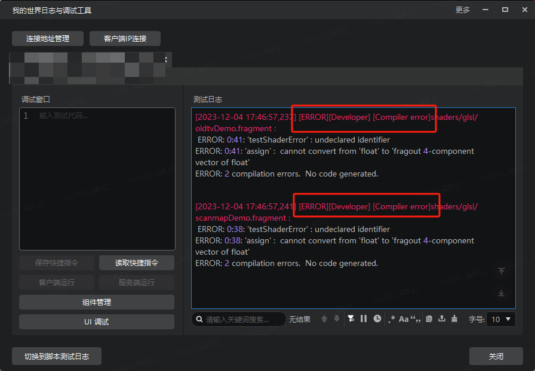
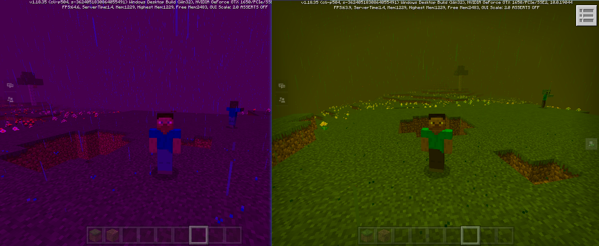
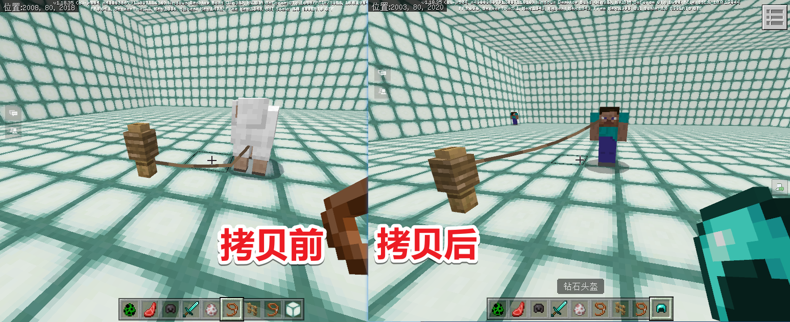
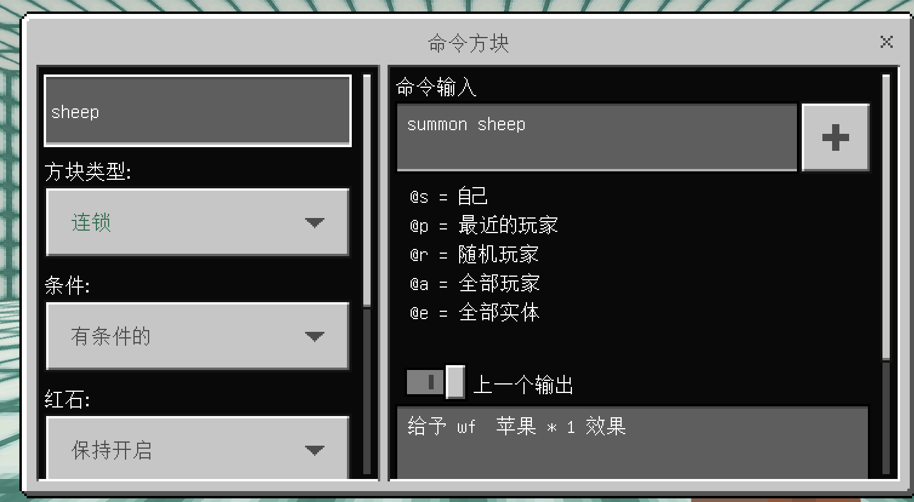
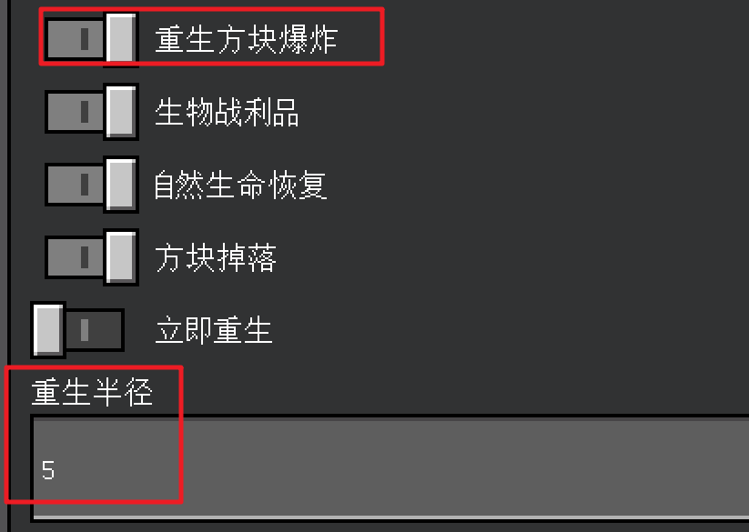

# 2.10
2023.12.20：版本号（V2.10 BE1.18.30）
包括Mod PC包，手机测试版启动器，和服务器引擎。

示例Demo：<a href="../../../mcguide/20-玩法开发/13-模组SDK编程/60-Demo示例.html" rel="noopenner">前往此处下载</a>

## 一、更新时间表
1. 在2023年12月20日上线2.10第一个Beta版。
2. 在2024年1月2日上线2.10第二个Beta版。
3. 在2024年1月18日上线2.10稳定版。
4. 在2024年1月26日，全渠道将更新2.10版本玩家包体，玩家将陆续更新到2.10版本，请开发者合理安排更新节奏。

## 二、重要功能更新

### 1. 材质编译错误输出到日志
现在如果你的模组适用的材质shader发生编译错误，也会输出**Compiler error**日志到调试工具了，方便您更快定位错误，如图：

### 2. 后处理参数拓展
本次我们为后处理自定义shader拓展了更多可用的参数，现在你可以在后处理的shader中引用他们了，包括：
当前所在维度，天气类型、世界时间、下雨与打雷强度、星星角度、天空颜色、环境光亮度、相机位置,如下图，可在同一个后处理效果中，根据不同的环境光亮度实现不同的颜色滤镜效果，详见<a href="../../../mcguide/16-美术/7-材质与着色器/4-材质实战.html#自定义后处理" rel="noopenner">这篇文档</a>。

### 3. 支持拷贝玩家渲染参数到实体实例
现在你可以通过[CopyPlayerRenderMaterialToOneActor](../接口/实体/渲染.md#copyplayerrendermaterialtooneactor)系列接口将玩家的贴图、材质和几何体拷贝到指定实体的实例身上了,如图所示。

### 4. 支持动态注册与移除自定义配方接口
新增了[RemoveRecipe](../接口/世界/配方.md#removerecipe)和[AddRecipe](../接口/世界/配方.md#addrecipe)两个接口，用于动态移除和注册自定义配方。

### 5. 方块实体NBT系列接口
对命令方块、漏斗、告示牌、物品展示框、酿造台等方块实体新增了设置和获取NBT属性的接口，详情参考[GetCommandBlock](../接口/方块/方块实体.md#getcommandblock)系列接口。

### 6. 支持创建带有附加值的抛射物
[CreateProjectileEntity](../接口/世界/实体管理.md#createprojectileentity)接口现在新增了auxvalue字段，可以创建不同状态效果的箭头和喷溅药水了。

### 7. 游戏规则设置接口补充部分设置选项
根据原生游戏补充了重生方块爆炸和重生半径两个选项。

### 8. 方块实体支持客户端tick和卸载事件
新增client_tick字段，配置可触发客户端tick事件，详见<a href="../../../mcguide/20-玩法开发/15-自定义游戏内容/2-自定义方块/4-自定义方块实体.html" rel="noopenner">这篇文档</a>。

### 9. attrvalue支持更多属性
现在[GetAttrValue](../接口/实体/属性.md#getattrvalue)接口支持更多类型的属性了，如击退抗性、护甲值、跳跃力度。

### 10. ModAttr支持手动存档
与SaveExtraData接口类似，我们为ModAttr组件也增加了[SaveAttr](../接口/实体/自定义属性.md#saveattr)接口，便于开发者手动存档所有属性。
### 11. 飞行接口细化
1. 我们调整了[ChangePlayerFlyState](../接口/玩家/行为.md#changeplayerflystate)接口，现在支持设置飞行权限时不立刻进入飞行状态
2. 新增了[IsPlayerCanFly](../接口/玩家/行为.md#isplayercanfly)接口判断是否具有飞行权限。

### 12. 其他更新与调整
1. 为了满足开发者对模型更高的精细度需求，我们调整网易方块模型的精度，从原有的0.25调整为0.0625，现在精度大于0.0625的模型细节都将被保留。
2. 轨迹运动器支持调整插值类型，详见[AddEntityTrackMotion](../接口/实体/行为.md#addentitytrackmotion)接口。

3. 开发者在修改玩家或生物的模型贴图后，如希望恢复到进入游戏时的默认状态，现在可以使用[ResetActorRender](../接口/实体/渲染.md#resetactorrender)和[ResetSkin](../接口/玩家/渲染.md#resetskin)接口重置玩家和实体的渲染参数，回到初始状态。
4. 修复了原生游戏的[minecraft:structure_template_feature](https://learn.microsoft.com/en-us/minecraft/creator/reference/content/featuresreference/examples/features/minecraftstructure_template_feature?view=minecraft-bedrock-stable)特征无法正常生效的问题。
5. 为了提升大量设置方块场景下的效率，我们对[SetBlockNew](../接口/世界/方块管理.md#setblocknew)接口新增了是否更新相邻方块的参数，若设置为false可提升该接口的运行效率。
6.  完善了PlaceStructure接口的参数，参照原版指令新增动画模式、动画时间、是否包含实体、是否移除方块、镜像模式、完整性、种子等可选参数，详见[PlaceStructure](../接口/世界/地图.md#placestructure)接口。

## 三、API更新
- 新增

1. 新增[IsHideNameTag](../接口/世界/渲染.md#ishidenametag)(客户端)， 获取是否隐藏场景内所有名字<!--by xsf-->

1. 新增[GetWalkState](../接口/原生UI.md#getwalkstate)(客户端)， 获取玩家行走/潜行/跑步状态<!--by xsf-->

1. 新增[SetCommandBlock](../接口/方块/方块实体.md#setcommandblock)(服务端)， 对命令方块进行内容设置<!--by cxz-->

1. 新增[GetCommandBlock](../接口/方块/方块实体.md#getcommandblock)(服务端)， 获取命令方块的设置内容<!--by cxz-->

1. 新增[ExecuteCommandBlock](../接口/方块/方块实体.md#executecommandblock)(服务端)， 执行一次命令方块<!--by cxz-->

1. 新增[SetHopperSpeed](../接口/方块/方块实体.md#sethopperspeed)(服务端)， 设置漏斗运输一个物品所需的时间（单位：红石刻，1秒10刻），默认值为4刻，该设置存档<!--by cxz-->

1. 新增[GetHopperSpeed](../接口/方块/方块实体.md#gethopperspeed)(服务端)， 获取漏斗运输一个物品所需的时间（单位：刻）<!--by cxz-->

1. 新增[SetSignTextStyle](../接口/方块/告示牌.md#setsigntextstyle)(服务端)， 设置告示牌的文本样式<!--by cxz-->

1. 新增[GetSignTextStyle](../接口/方块/告示牌.md#getsigntextstyle)(服务端)， 获取告示牌的文本样式信息<!--by cxz-->

1. 新增[SetFrameRotation](../接口/方块/方块实体.md#setframerotation)(服务端)， 设置物品展示框里物品的顺时针旋转角度<!--by cxz-->

1. 新增[GetFrameRotation](../接口/方块/方块实体.md#getframerotation)(服务端)， 获取物品展示框里物品的顺时针旋转角度<!--by cxz-->

1. 新增[SetFrameItemDropChange](../接口/方块/方块实体.md#setframeitemdropchange)(服务端)， 设置点击物品展示框时生成掉落的几率，默认为1<!--by cxz-->

1. 新增[GetFrameItemDropChange](../接口/方块/方块实体.md#getframeitemdropchange)(服务端)， 获取物品展示框里物品的掉落几率<!--by cxz-->

1. 新增[SetFrameItem](../接口/方块/方块实体.md#setframeitem)(服务端)， 设置物品展示框的物品<!--by cxz-->

1. 新增[GetFrameItem](../接口/方块/方块实体.md#getframeitem)(服务端)， 获取物品展示框的物品<!--by cxz-->

1. 新增[IsPlayerCanFly](../接口/玩家/行为.md#isplayercanfly)(服务端)， 获取玩家能否飞行<!--by xsf-->

1. 新增[SetBrewingStandSlotItem](../接口/方块/容器.md#setbrewingstandslotitem)(服务端)， 设置酿造台指定槽位物品<!--by cxz-->

1. 新增[GetBrewingStandSlotItem](../接口/方块/容器.md#getbrewingstandslotitem)(服务端)， 获取酿造台指定槽位物品<!--by cxz-->

1. 新增[GetAllEnchantsInfo](../接口/物品.md#getallenchantsinfo)(服务端)， 服务端获取目前已注册的所有附魔信息<!--by xsf-->

1. 新增[SaveAttr](../接口/实体/自定义属性.md#saveattr)(服务端)， 保存SetAttr设置的属性值<!--by cxz-->

1. 新增[SetOperatorCommandAbility](../接口/玩家/权限.md#setoperatorcommandability)(服务端)， 设置玩家是否具有操作员命令权限<!--by cxz-->

1. 新增[SetTeleportAbility](../接口/玩家/权限.md#setteleportability)(服务端)， 设置玩家能否使用TP指令<!--by cxz-->

1. 新增[SetPlayerMute](../接口/玩家/权限.md#setplayermute)(服务端)， 设置玩家是否禁言，该接口的设置不存档<!--by cxz-->

1. 新增[SetPermissionLevel](../接口/玩家/权限.md#setpermissionlevel)(服务端)， 设置玩家权限等级<!--by cxz-->

1. 新增[RemoveRecipe](../接口/世界/配方.md#removerecipe)(服务端)， 动态禁用配方<!--by xsf-->

1. 新增[AddRecipe](../接口/世界/配方.md#addrecipe)(服务端)， 动态注册配方<!--by xsf-->

1. 新增[ResetActorRender](../接口/实体/渲染.md#resetactorrender)(客户端)， 增加重置实体渲染接口<!--by xsf-->

1. 新增[CopyPlayerRenderMaterialToOneActor](../接口/实体/渲染.md#copyplayerrendermaterialtooneactor)(客户端)， 将渲染材质从某个玩家拷贝到某个生物上<!--by cxz-->

1. 新增[CopyPlayerGeometryToOneActor](../接口/实体/渲染.md#copyplayergeometrytooneactor)(客户端)， 将渲染几何体从某个玩家拷贝到某个生物上<!--by cxz-->

1. 新增[RebuildRenderForOneActor](../接口/实体/渲染.md#rebuildrenderforoneactor)(客户端)， 使用完entity类渲染接口后，重建单个生物渲染控制器<!--by czx-->

1. 新增[ResetRenderForOneActor](../接口/实体/渲染.md#resetrenderforoneactor)(客户端)， 将调用OneActor类渲染接口的生物重置回种群<!--by cxz-->

1. 新增[CopyPlayerTextureToOneActor](../接口/实体/渲染.md#copyplayertexturetooneactor)(客户端)， 将贴图从某个玩家拷贝到某个生物上<!--by cxz-->

1. 新增[GetAllEnchantsInfo](../接口/物品.md#getallenchantsinfo)(客户端)， 客户端获取目前已注册的所有附魔信息<!--by xsf-->

1. 新增[IsShowName](../接口/实体/渲染.md#isshowname)(客户端)， 新增获取实体nametag是否（按游戏默认逻辑）显示<!--by xsf-->

1. 新增[ItemDurabilityChangedServerEvent](../事件/物品.md#itemdurabilitychangedserverevent)(服务端)， 物品耐久度变化时触发该事件<!--by xsf-->

1. 新增[PlayerHungerChangeServerEvent](../事件/玩家.md#playerhungerchangeserverevent)(服务端)， 玩家饥饿度变化事件<!--by xsf-->

1. 新增[ModBlockEntityRemoveClientEvent](../事件/方块.md#modblockentityremoveclientevent)(客户端)， 客户端自定义方块实体卸载时触发<!--by xsf-->

1. 新增[ModBlockEntityTickClientEvent](../事件/方块.md#modblockentitytickclientevent)(客户端)， 客户端自定义方块实体tick事件，每秒20次<!--by xsf-->

1. 新增[AttrType](../枚举值/AttrType.md)， 新增对AttrType.FOLLOW_RANGE,AttrType.KNOCKBACK_RESISTANCE,AttrType.JUMP_STRENGTH,AttrType.ARMOR的支持<!--by xsf-->

1. 新增[WalkState](../枚举值/WalkState.md)， 玩家行走模式<!--by xsf-->

- 调整

1. 调整[AddEntityTrackMotion](../接口/实体/行为.md#addentitytrackmotion)(服务端)， 增加插值类型<!--by xusifan-->

1. 调整[AddPlayerTrackMotion](../接口/玩家/行为.md#addplayertrackmotion)(服务端)， 增加插值类型<!--by xusifan-->

1. 调整[SetAttrValue](../接口/实体/属性.md#setattrvalue)(服务端)， 新增对AttrType.FOLLOW_RANGE,AttrType.KNOCKBACK_RESISTANCE,AttrType.JUMP_STRENGTH的支持<!--by xsf-->

1. 调整[GetAttrValue](../接口/实体/属性.md#getattrvalue)(服务端)， 新增对AttrType.FOLLOW_RANGE,AttrType.KNOCKBACK_RESISTANCE,AttrType.JUMP_STRENGTH,AttrType.ARMOR的支持<!--by xsf-->

1. 调整[SetAttrMaxValue](../接口/实体/属性.md#setattrmaxvalue)(服务端)， 新增对AttrType.FOLLOW_RANGE,AttrType.KNOCKBACK_RESISTANCE,AttrType.JUMP_STRENGTH的支持<!--by xsf-->

1. 调整[GetAttrMaxValue](../接口/实体/属性.md#getattrmaxvalue)(服务端)， 新增对AttrType.FOLLOW_RANGE,AttrType.KNOCKBACK_RESISTANCE,AttrType.JUMP_STRENGTH的支持<!--by xsf-->

1. 调整[SetBlockNew](../接口/世界/方块管理.md#setblocknew)(服务端)， 增加updateNeighbors参数设置是否触发相邻方块的更新<!--by czh-->

1. 调整[GetAllEffects](../接口/实体/状态效果.md#getalleffects)(服务端)， 增加浮点型持续时间<!--by xsf-->

1. 调整[ChangePlayerFlyState](../接口/玩家/行为.md#changeplayerflystate)(服务端)， 增加是否进入飞行状态参数<!--by xsf-->

1. 调整[SetGameRulesInfoServer](../接口/世界/游戏规则.md#setgamerulesinfoserver)(服务端)， 增加了“重生方块爆炸”、“重生半径”的字段<!--by xsf-->

1. 调整[GetGameRulesInfoServer](../接口/世界/游戏规则.md#getgamerulesinfoserver)(服务端)， 增加了“重生方块爆炸”、“重生半径”的字段<!--by xsf-->

1. 调整[PlaceStructure](../接口/世界/地图.md#placestructure)(服务端)， 新增动画模式、动画时间、是否包含实体、是否移除方块、镜像模式、完整性、种子<!--by cxz-->

1. 调整[SetAttr](../接口/实体/自定义属性.md#setattr)(服务端)， 新增autoSave用于控制当needRestore为True时是否立刻存档<!--by cxz-->

1. 调整[SetPlayerPrefixAndSuffixName](../接口/玩家/属性.md#setplayerprefixandsuffixname)(服务端)， 新增名字颜色参数<!--by xsf-->

1. 调整[CreateProjectileEntity](../接口/世界/实体管理.md#createprojectileentity)(服务端)， 增加auxvalue字段，支持定义原生弓箭、喷溅药水auxvalue值<!--by xsf-->

1. 调整[GetAttrValue](../接口/实体/属性.md#getattrvalue)(客户端)， 新增对AttrType.FOLLOW_RANGE,AttrType.KNOCKBACK_RESISTANCE,AttrType.JUMP_STRENGTH,AttrType.ARMOR的支持<!--by xsf-->

1. 调整[GetAttrMaxValue](../接口/实体/属性.md#getattrmaxvalue)(客户端)， 新增对AttrType.FOLLOW_RANGE,AttrType.KNOCKBACK_RESISTANCE,AttrType.JUMP_STRENGTH的支持<!--by xsf-->

1. 调整[AddCameraTrackMotion](../接口/玩家/摄像机.md#addcameratrackmotion)(客户端)， 增加插值类型<!--by xusifan-->

1. 调整[GetAllEffects](../接口/实体/状态效果.md#getalleffects)(客户端)， 增加浮点型持续时间<!--by xsf-->

1. 调整[ResetSkin](../接口/玩家/渲染.md#resetskin)(客户端)， 增加isSteve参数，用于指定是否还原到Steve模型的皮肤,默认为True。当isSteve为False时，则还原成资源中心中购买并穿戴的皮肤<!--by xsf-->

1. 调整[ServerItemTryUseEvent](../事件/物品.md#serveritemtryuseevent)(服务端)， cancel设置为true后不再触发ItemUseAfterServerEvent<!--by xsf-->

1. 调整[ActorUseItemServerEvent](../事件/物品.md#actoruseitemserverevent)(服务端)， 喝牛奶支持触发该事件<!--by xsf-->

1. 调整[PlayerEatFoodServerEvent](../事件/玩家.md#playereatfoodserverevent)(服务端)， 支持蛋糕、牛奶触发该事件<!--by xsf-->

1. 调整[PushScreenEvent](../事件/UI.md#pushscreenevent)(客户端)， 新增screenDef参数，返回包含命名空间的UI名字<!--by czh-->

1. 调整[PopScreenEvent](../事件/UI.md#popscreenevent)(客户端)， 新增screenDef参数，返回包含命名空间的UI名字<!--by czh-->

1. 调整[PopScreenAfterClientEvent](../事件/UI.md#popscreenafterclientevent)(客户端)， 新增screenDef参数，返回包含命名空间的UI名字<!--by czh-->

1. 调整[OnItemSlotButtonClickedEvent](../事件/UI.md#onitemslotbuttonclickedevent)(客户端)， 增加盔甲栏、副手栏触发<!--by xsf-->

