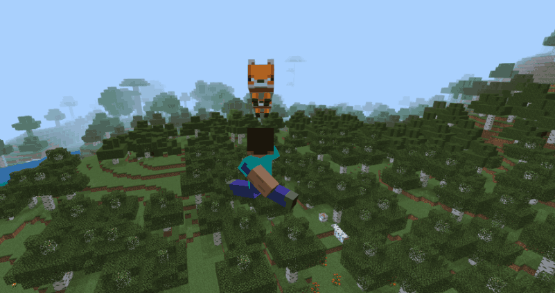
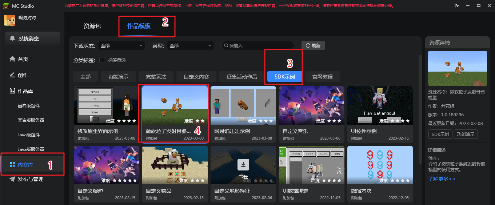
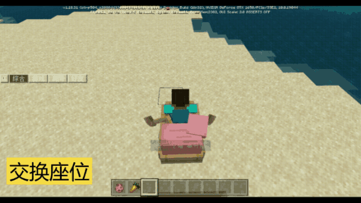
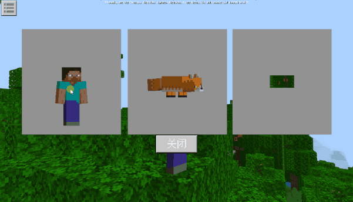
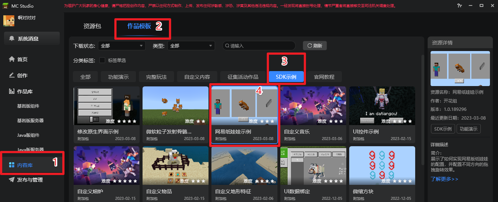
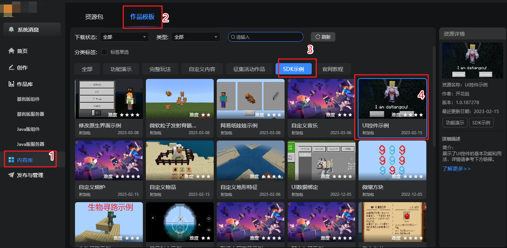

# 2.6
2023.03.14：版本号（V2.6 BE1.18.30）
包括Mod PC包，手机测试版启动器，和服务器引擎。

示例Demo：
[点击此处下载](https://g79.gdl.netease.com/2.6DemoV2.zip)

## 一、更新时间表
1. 在3月14日上线2.6第一个Beta版。
2. 在3月28日上线2.6第二个Beta版。
3. 在4月6日上线2.6稳定版。
4. 在4月14日，全渠道将更新2.6版本玩家包体，玩家将陆续更新到2.6版本，请开发者合理安排更新节奏。

## 二、更新内容

### 特效
#### 1. 原版粒子特效支持发射模型
- 在原版微软粒子的基础上支持发射骨骼模型，并且支持纹理和动画，详情请参考<a href="../../../mcguide/16-美术/9-特效/21-原版特效属性详细说明.html#发射骨骼模型" rel="noopenner">这篇文档</a>。

- 示例Demo新增了粒子发射骨骼模型的示例，详情参考NeteaseModelParticleDemo，同时也可在内容库进行下载和查看。

### 实体

#### 1.坐骑骑乘API拓展
- 在现有坐骑的接口上，新增了坐骑座位的增删改、骑乘者更换座位、锁定座位等接口，帮助开发者更便捷地实现丰富的骑乘效果。详情请参考<a href="../../../mcguide/20-玩法开发/15-自定义游戏内容/3-自定义生物/05-使用API自定义坐骑.html" rel="noopenner">这篇文档</a>

#### 2.运动器功能优化
- 环绕实体运动器系列接口支持指定环绕半径，详情参考接口[添加环绕实体运动器](../接口/实体/行为.md#AddEntityAroundPointMotion)
- 轨迹运动器系列接口支持起始角度和目标角度，详情参考接口[添加轨迹运动器](../接口/实体/行为.md#addentitytrackmotion)

> 上述优化对实体、玩家、相机的运动器接口均生效。

### UI

#### 1. 纸娃娃控件拓展

- 网易版纸娃娃（NeteasePaperDoll）控件现在支持绕X、Z轴的拖拽旋转，详见下图：

- 示例Demo新增了网易纸娃娃示例，可在内容库中查看，如下图所示：

- 

#### 2. 模拟HUD操作接口

- 为了帮助开发者更好地定制全新的UI，本次新增了更多模拟原生UI操作的接口，详情见[原生UI](../接口/原生UI.md)接口。

#### 3. 原生界面支持动态修改，面向对象编程
- 对暂停界面，背包界面等原生界面，现在不仅支持在他们之上添加自定义的控件，并且支持以<a href="../../../mcguide/18-界面与交互/40-UIAPI文档.html#screennode" rel="noopenner">ScreenNode</a>对象管理他们，对他们进行直接修改，详见<a href="../../../mcguide/18-界面与交互/61-原生界面修改文档.html" rel="noopenner"> 原生界面修改 </a>。
- 支持使用接口动态创建删除控件，而不是仅仅通过克隆控件的方式，详见[CreateChildControl](../接口/自定义UI/UI界面.md#createchildcontrol)以及[RemoveChildControl](../接口/自定义UI/UI界面.md#removechildcontrol)接口。
- 支持全局获取当前顶层界面的<a href="../../../mcguide/18-界面与交互/40-UIAPI文档.html#screennode" rel="noopenner">ScreenNode</a>管理对象，详见[GetTopUINode](../接口/自定义UI/通用.md#gettopuinode)接口。

#### 4. 富文本控件支持换行标签
- 富文本控件现在支持换行标签` `，详情参考<a href="../../../mcguide/18-界面与交互/30-UI说明文档.html#富文本控件介绍" rel="noopenner">富文本控件介绍</a>。

#### 5. 新增获取部分控件属性接口
- 新增接口[GetToggleState](../接口/自定义UI/UI控件.md#gettogglestate)获取开关控件（toggle）的开关状态。
- 新增接口[GetGridItem](../接口/自定义UI/UI控件.md#getgriditem)获取网格控件（grid）的子节点。
- 新增接口[GetScrollViewPercentValue](../接口/自定义UI/UI控件.md#getscrollviewpercentvalue)获取滚动列表（scroll_view）的滚动条百分比。

#### 6.优化了UI控件示例
- 将原有的UI控件示例模板按照控件的功能拆分为多个脚本，优化了代码的布局和注释。

- 详情可在内容库中查看UI控件示例，如下图所示

### 物品
#### 1. 所有自定义物品支持渲染偏移组件

- `netease:render_offset`组件以前仅支持可蓄力物品，现在它可以对任意类型的自定义物品生效了。

#### 2. 自定义物品分页同名合并
- 此前多个mod使用同名物品分页会出现冲突，现在使用同名物品分页的mod物品会被合并显示在同一个分页下了。

### 方块

#### 1. 方块调色板接口优化
- 方块调色板系列接口支持剔除空气方块，详情参考接口[GetBlockPaletteBetweenPos](../接口/世界/方块组合.md#getblockpalettebetweenpos)

### 玩家

#### 1. 相机交互范围优化
- 修改相机锚点和偏移时，会同步修改玩家的交互范围，避免了调整相机后选取方块的偏移问题，详见[SetCameraOffset](../接口/玩家/摄像机.md#setcameraoffset)和[SetCameraAnchor](../接口/玩家/摄像机.md#setcameraanchor)
#### 2. 玩家皮肤渲染优化
- 修复了渲染指定玩家皮肤时，会影响到其他同款皮肤玩家的问题。

### 其他
#### 1. 支持玩家反馈包含模组日志（全渠道上线后生效）
   - 现在mod脚本运行出现报错时，将会打印到玩家设备中，玩家反馈模组问题时，可勾选上传此日志，开发者便可在开发者平台下载和查看该日志。
   - 日志打印功能默认关闭，开发者需要通过[SetMcpModLogCanPostDump](../接口/通用/调试.md#setmcpmodlogcanpostdump)接口开启该脚本的日志打印功能，接口对每个mod脚本（MCP）独立生效。
   - 开启此功能后，除了代码报错会被打印，开发者也可以使用接口[PostMcpModDump](../接口/通用/调试.md#postmcpmoddump)自定义打印MCP日志，此日志也会打印到玩家设备，并通过反馈上传到开发者的组件后台。
   > 注意事项：
   > 1. 此功能依赖玩家客户端和开发者平台的更新，仅在全渠道上线后方可生效。
   > 2. 请勿打印过多自定义日志信息，避免玩家的存档大小快速膨胀，影响玩家对模组的体验。
   > 3. 日志在玩家本地只保留7天，超期日志自动清理。

#### 2. 新增接口和事件索引表
- 在接口文档中增加了所有接口和事件的文档，供开发者在同一页面进行浏览和搜索，详见[Api索引表](../接口/Api索引表.md)和[事件索引表](../事件/事件索引表.md)

## API更新

- 新增

1. 新增[GetServerTickTime](../接口/通用/工具.md#getserverticktime)(服务端)， 获取服务端引擎上一帧的帧消耗时间<!--by czh-->

1. 新增[SetMcpModLogCanPostDump](../接口/通用/调试.md#setmcpmodlogcanpostdump)(服务端)， 设置是否可打印MCP日志<!--by wtq-->

1. 新增[GetMcpModLogCanPostDump](../接口/通用/调试.md#getmcpmodlogcanpostdump)(服务端)， 获取是否可打印MCP日志<!--by wtq-->

1. 新增[PostMcpModDump](../接口/通用/调试.md#postmcpmoddump)(服务端)， 打印MCP日志<!--by wtq-->

1. 新增[GetTopUINode](../接口/自定义UI/通用.md#gettopuinode)(客户端)， 获取Push进来的最顶层界面，包括原生界面<!--by mayexing-->

1. 新增[GetUIScreenProxyCls](../接口/自定义UI/通用.md#getuiscreenproxycls)(客户端)， 获得原生界面Screen代理基类<!--by mayexing-->

1. 新增[ChangeWalkState](../接口/原生UI.md#changewalkstate)(客户端)， 切换行走/潜行/跑步状态<!--by hxj-->

1. 新增[ChangeSneakState](../接口/原生UI.md#changesneakstate)(客户端)， 切换潜行状态<!--by hxj-->

1. 新增[SimulateJump](../接口/原生UI.md#simulatejump)(客户端)， 模拟跳跃<!--by hxj-->

1. 新增[ClickInteractGUI](../接口/原生UI.md#clickinteractgui)(客户端)， 模拟点击交互按钮<!--by hxj-->

1. 新增[SetMcpModLogCanPostDump](../接口/通用/调试.md#setmcpmodlogcanpostdump)(客户端)， 设置是否可打印MCP日志<!--by wtq-->

1. 新增[GetMcpModLogCanPostDump](../接口/通用/调试.md#getmcpmodlogcanpostdump)(客户端)， 获取是否可打印MCP日志<!--by wtq-->

1. 新增[PostMcpModDump](../接口/通用/调试.md#postmcpmoddump)(客户端)， 打印MCP日志<!--by wtq-->

1. 新增[SetActorCollidable](../接口/实体/行为.md#setactorcollidable)(服务端)， 设置实体是否可碰撞<!--by huangxiaojie03-->

1. 新增[GetLoadBlocks](../接口/方块/属性.md#getloadblocks)(服务端)， 获取已经加载的方块id<!--by huangxiaojie03-->

1. 新增[OpenClientChunkGeneration](../接口/世界/地图.md#openclientchunkgeneration)(服务端)， 开启/关闭客户端区块生成功能。<!--by xg-->

1. 新增[HasEffect](../接口/实体/状态效果.md#haseffect)(服务端)， 获取实体是否存在当前状态效果<!--by huangxiaojie03-->

1. 新增[GetLoadActors](../接口/实体/属性.md#getloadactors)(服务端)， 获取已加载的实体id<!--by huangxiaojie03-->

1. 新增[GetLoadItems](../接口/物品.md#getloaditems)(服务端)， 获取已经加载的物品id<!--by huangxiaojie03-->

1. 新增[SetEntityLockRider](../接口/实体/行为.md#setentitylockrider)(服务端)， 设置坐骑上的实体是否锁定序号<!--by hyt-->

1. 新增[ChangeRiderSeat](../接口/实体/行为.md#changeriderseat)(服务端)， 设置骑乘者在当前坐骑上的序号<!--by hyt-->

1. 新增[GetRiders](../接口/实体/行为.md#getriders)(服务端)， 获取坐骑上的骑乘者信息<!--by hyt-->

1. 新增[AddEntitySeat](../接口/实体/行为.md#addentityseat)(服务端)， 增加坐骑座位<!--by hyt-->

1. 新增[SetEntitySeat](../接口/实体/行为.md#setentityseat)(服务端)， 设置坐骑座位的位置、旋转以及允许实体旋转范围<!--by hyt-->

1. 新增[DeleteEntitySeat](../接口/实体/行为.md#deleteentityseat)(服务端)， 删除坐骑座位<!--by hyt-->

1. 新增[LockVerticalMove](../接口/控制.md#lockverticalmove)(客户端)， 模拟上升或下降<!--by hxj-->

1. 新增[UnLockVerticalMove](../接口/控制.md#unlockverticalmove)(客户端)， 解除上升或下降状态<!--by hxj-->

1. 新增[AddPlayerScriptAnimate](../接口/玩家/渲染.md#addplayerscriptanimate)(客户端)， 在玩家的客户端实体定义（minecraft:client_entity）json中的scripts/animate节点添加动画/动画控制器<!--by cxz-->

1. 新增[GetModelStyle](../接口/模型.md#getmodelstyle)(客户端)， 获取模型类型<!--by huangxiaojie03-->

1. 新增[GetAllEffects](../接口/实体/状态效果.md#getalleffects)(客户端)， 获取实体当前所有状态效果<!--by huangxiaojie03-->

1. 新增[HasEffect](../接口/实体/状态效果.md#haseffect)(客户端)， 获取实体是否存在当前状态效果<!--by huangxiaojie03-->

1. 新增[CreateChildControl](../接口/自定义UI/UI界面.md#createchildcontrol)(客户端)， 在当前界面创建子控件<!--by mayexing-->

1. 新增[RemoveChildControl](../接口/自定义UI/UI界面.md#removechildcontrol)(客户端)， 移除当前画布中的子控件<!--by mayexing-->

1. 新增[GetGridItem](../接口/自定义UI/UI控件.md#getgriditem)(客户端)， 根据网格位置获取元素控件<!--by mayexing-->

1. 新增[GetScrollViewPercentValue](../接口/自定义UI/UI控件.md#getscrollviewpercentvalue)(客户端)， 支持获取当前scroll_view内容的百分比位置<!--by mayexing-->

1. 新增[GetToggleState](../接口/自定义UI/UI控件.md#gettogglestate)(客户端)， 获取Toggle开关控件的值<!--by mayexing-->

1. 新增[PopScreenAfterClientEvent](../事件/UI.md#popscreenafterclientevent)(客户端)， 新增PopScreenAfterClientEvent，当弹出动作全部完成时触发<!--by cxz-->

1. 新增[CloseNeteaseShopEvent](../事件/UI.md#closeneteaseshopevent)(客户端)， 玩家关闭商城界面的时候抛出的事件<!--by cxz-->

- 调整

1. 调整[OpenPauseGui](../接口/原生UI.md#openpausegui)(客户端)， 增加使用说明<!--by hxj-->

1. 调整[OpenChatGui](../接口/原生UI.md#openchatgui)(客户端)， 增加使用说明<!--by hxj-->

1. 调整[OpenVoiceGui](../接口/原生UI.md#openvoicegui)(客户端)， 补充使用说明<!--by hxj-->

1. 调整[AddEntityTrackMotion](../接口/实体/行为.md#addentitytrackmotion)(服务端)， 给实体（不含玩家）轨迹运动器添加朝向控制<!--by wangdingdong-->

1. 调整[AddEntityAroundEntityMotion](../接口/实体/行为.md#addentityaroundentitymotion)(服务端)， 对实体环绕运动器可以指定半径<!--by wangdingdong-->

1. 调整[AddPlayerTrackMotion](../接口/玩家/行为.md#addplayertrackmotion)(服务端)， 给玩家轨迹运动器添加朝向控制<!--by wangdingdong-->

1. 调整[AddPlayerAroundEntityMotion](../接口/玩家/行为.md#addplayeraroundentitymotion)(服务端)， 对实体环绕运动器可以指定半径<!--by wangdingdong-->

1. 调整[GetBlockPaletteBetweenPos](../接口/世界/方块组合.md#getblockpalettebetweenpos)(服务端)， 增加eliminateAir参数，可决定生成的方块调色板中是否剔除多余的空气方块。<!--by xujiarong02-->

1. 调整[SetPlayerRideEntity](../接口/玩家/行为.md#setplayerrideentity)(服务端)， 支持设置玩家成为第n个骑乘者<!--by hyt-->

1. 调整[SetRiderRideEntity](../接口/实体/行为.md#setriderrideentity)(服务端)， 支持设置玩家成为第n个骑乘者<!--by hyt-->

1. 调整[GetInputVector](../接口/控制.md#getinputvector)(客户端)， 修复了无法正常获取到LockInputVector的输入量的BUG<!--by cxz-->

1. 调整[LockInputVector](../接口/控制.md#lockinputvector)(客户端)， 修复了潜行状态下移动速度不变的BUG，修复了GetInputVector无法正常获取到LockInputVector的输入量的BUG<!--by cxz-->

1. 调整[GetBlockPaletteBetweenPos](../接口/世界/方块组合.md#getblockpalettebetweenpos)(客户端)， 增加eliminateAir参数，可决定生成的方块调色板中是否剔除多余的空气方块。<!--by xujiarong02-->

1. 调整[SetCameraOffset](../接口/玩家/摄像机.md#setcameraoffset)(客户端)， 修复了设置偏移后，无法正常交互的BUG<!--by cxz-->

1. 调整[SetCameraAnchor](../接口/玩家/摄像机.md#setcameraanchor)(客户端)， 修复了设置偏移后，无法正常交互的BUG<!--by cxz-->

1. 调整[AddCameraTrackMotion](../接口/玩家/摄像机.md#addcameratrackmotion)(客户端)， 给相机轨迹运动器添加朝向控制<!--by wangdingdong-->

1. 调整[AddCameraAroundEntityMotion](../接口/玩家/摄像机.md#addcameraaroundentitymotion)(客户端)， 对实体环绕运动器可以指定半径<!--by wangdingdong-->

1. 调整[GetVariable](../接口/特效/微软粒子.md#getvariable)(客户端)， 新增发射器移动速度变量variable.emitter_speed<!--by dengruitao-->

1. 调整[SetVariable](../接口/特效/微软粒子.md#setvariable)(客户端)， 新增发射器移动速度变量variable.emitter_speed<!--by dengruitao-->

1. 调整[GetMolangValue](../接口/实体/molang.md#getmolangvalue)(客户端)， 修复了pc下，molang变量为字符串时，返回值被转换成32位整形的问题<!--by czh-->

1. 调整[GetStringHash64](../接口/实体/molang.md#getstringhash64)(客户端)， 修复了pc下返回值被转换成32位整形的问题<!--by czh-->

1. 调整[RenderEntity](../接口/自定义UI/UI控件.md#renderentity)(客户端)， param新增rotation_axis参数<!--by cxz-->

1. 调整[RenderSkeletonModel](../接口/自定义UI/UI控件.md#renderskeletonmodel)(客户端)， param新增rotation_axis参数<!--by cxz-->

1. 调整[RenderBlockGeometryModel](../接口/自定义UI/UI控件.md#renderblockgeometrymodel)(客户端)， param新增rotation_axis参数<!--by cxz-->

- 废弃（将在未来不可用）

1. 废弃SetActorCollidable，单独设置客户端不生效，建议设置服务端

