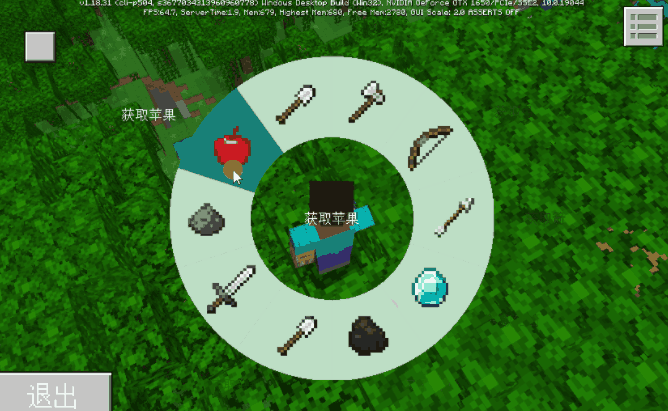
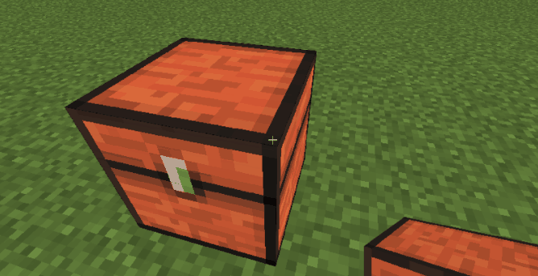
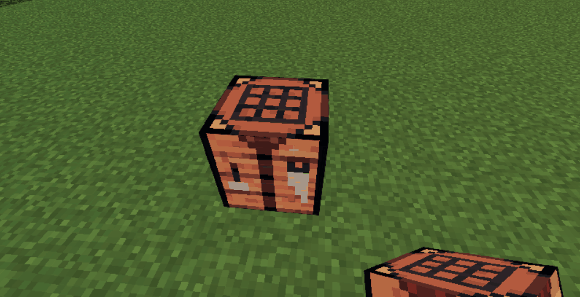
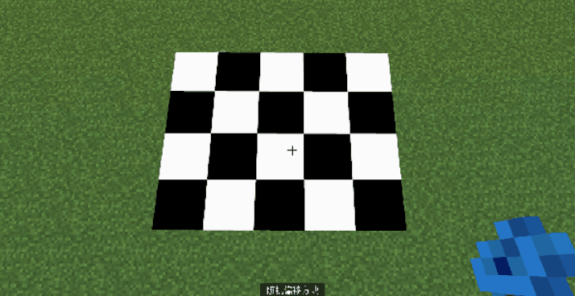

# 2.7
2023.05.26：版本号（V2.7 BE1.18.30）
包括Mod PC包，手机测试版启动器，和服务器引擎。

示例Demo：
[点击此处下载](https://g79.gdl.netease.com/2.7DemoV2.zip)

## 一、更新时间表
1. 在5月26日上线2.7第一个Beta版。
2. 在6月09日上线2.7第二个Beta版。
3. 在6月21日上线2.7稳定版。
4. 在6月28日，全渠道将更新2.7版本玩家包体，玩家将陆续更新到2.7版本，请开发者合理安排更新节奏。

## 二、重要功能更新

### 支持UI设置到世界坐标

在CreateUI接口的参数中新增了绑定到世界坐标的参数，支持设置UI到指定坐标，详情参考[CreateUI接口](../接口/自定义UI/通用.md#createui)。

### 支持渲染指定掉落物
新增AddDropItemToWorld接口，将指定掉落物添加到指定坐标，详情参考[AddDropItemToWorld接口](../接口/方块/渲染.md#adddropitemtoworld)。

### 自定义大型特征
新增拼图方块、自定义大型特征和结构池的数据驱动json，用于实现跨多个区块的大型随机特征（如原版村庄）效果，详情参考<a href="../../../mcguide/20-玩法开发/15-自定义游戏内容/4-自定义维度/6-自定义大型特征.html" rel="noopenner">这篇文档</a>。

### 中国版粒子支持拖尾渲染器
中国版粒子新增拖尾渲染模块，实现条带拖尾特效，详情请参考<a href="../../../mcguide/16-美术/9-特效/70-中国版特效属性详细说明.html#粒子拖尾效果属性说明" rel="noopenner">中国版粒子特效说明文档</a>

### UI新增轮盘控件
UI新增了一种轮盘控件，可用于自定义轮盘菜单，详情请参考<a href="../../../mcguide/18-界面与交互/30-UI说明文档.html#selectionwheel" rel="noopenner">轮盘控件说明文档</a>。

### 自定义箱子
方块配置新增自定义箱子组件，可使方块具有箱子的储物功能，支持自定义容量，<a href="../../../mcguide/20-玩法开发/15-自定义游戏内容/2-自定义方块/1-JSON组件.html#netease-block-chest" rel="noopenner">方块Json组件文档</a>。

### 自定义树叶
新增了netease:no_crop_face_block组件，使其在相邻面渲染一个面，实现原版树叶方块的效果,详情请参考<a href="../../../mcguide/20-玩法开发/15-自定义游戏内容/2-自定义方块/1-JSON组件.html#netease-no-crop-face-block" rel="noopenner">方块Json组件文档</a>。

### 自定义工作台
新增了自定义工作台组件，可让方块具有工作台的特性，支持自定义该工作台的专属配方，详情参考<a href="../../../mcguide/20-玩法开发/15-自定义游戏内容/2-自定义方块/3-特殊方块/10-自定义工作台.html" rel="noopenner">自定义工作台</a>。

### 自定义随机偏移方块
新增随机偏移组件netease:block_random_offset，使方块放置时可自定义随机偏移范围，详情参考<a href="../../../mcguide/20-玩法开发/15-自定义游戏内容/2-自定义方块/1-JSON组件.html#netease-block-random-offset" rel="noopenner">方块Json组件文档</a>。

### 其他
1. 相机支持设置翻滚角，详见[SetCameraRot](../接口/玩家/摄像机.md#setcamerarot)。
2. 与自定义物品类似，自定义方块也支持customtips组件了，详见<a href="../../../mcguide/20-玩法开发/15-自定义游戏内容/2-自定义方块/1-JSON组件.html#netease-custom-tips" rel="noopenner">方块Json组件文档</a>。
3. 自定义属性接口现在支持存档了，详见[SetAttr](../接口/实体/自定义属性.md#setattr)接口。

4. 新增了官方聊天扩展的5个功能接口，用于开发者定制聊天功能，详见[RegisterChatPrefix](../接口/实体/官方聊天扩展.md#registerchatprefix)。

> 温馨提示：上述聊天扩展接口仅在全渠道上线后方能生效！
### 重要修复
1. 当使用<a href="../../../mcguide/20-玩法开发/10-基本概念/1-我的世界基础概念.html#物品信息字典" rel="noopenner">物品信息字典</a>时，如果enchantData里的附魔等级超过该附魔的最高等级，将会导致对该物品的生成（如SpawnItemToPlayerInv）和设置（如SetEntityItem）等接口失败。
> 在此版本之前，会生成一个无附魔的物品。

## 三、API更新

- 新增

1. 新增[GetLocalPosFromWorld](../接口/通用/数学.md#getlocalposfromworld)(服务端)， 获取基于实体的世界坐标对应的局部坐标<!--by yangzhiwei-->

1. 新增[GetWorldPosFromLocal](../接口/通用/数学.md#getworldposfromlocal)(服务端)， 获取基于实体的局部坐标对应的世界坐标<!--by yangzhiwei-->

1. 新增[GetLocalPosFromWorld](../接口/通用/数学.md#getlocalposfromworld)(客户端)， 获取基于实体的世界坐标对应的局部坐标<!--by yangzhiwei-->

1. 新增[GetWorldPosFromLocal](../接口/通用/数学.md#getworldposfromlocal)(客户端)， 获取基于实体的局部坐标对应的世界坐标<!--by yangzhiwei-->

1. 新增[GetPlayerList](../接口/世界/实体管理.md#getplayerlist)(客户端)， 客户端获取level中所有玩家的id列表<!--by yangzhiwei-->

1. 新增[GetEngineActor](../接口/世界/实体管理.md#getengineactor)(客户端)， 客户端获取所有实体（不包含玩家）。<!--by yangzhiwei-->

1. 新增[SetPlayerMotion](../接口/玩家/行为.md#setplayermotion)(服务端)， 设置玩家瞬时移动方向向量<!--by hdy-->

1. 新增[SetJigsawBlock](../接口/世界/方块管理.md#setjigsawblock)(服务端)， 在某一位置放置拼图方块<!--by handaoying-->

1. 新增[RegisterChatPrefix](../接口/实体/官方聊天扩展.md#registerchatprefix)(服务端)， 官方聊天拓展功能 为游戏内指定玩家注册聊天前缀<!--by wj-->

1. 新增[SetShowSocialNearbyInfo](../接口/实体/官方聊天扩展.md#setshowsocialnearbyinfo)(服务端)， 官方聊天扩展功能 是否显示社交界面同一游戏的附近信息<!--by wj-->

1. 新增[AddCommonPhrases](../接口/实体/官方聊天扩展.md#addcommonphrases)(服务端)， 官方聊天扩展功能 新增常用聊天短语<!--by wj-->

1. 新增[RemoveCommonPhrases](../接口/实体/官方聊天扩展.md#removecommonphrases)(服务端)， 官方聊天扩展功能 移除常用聊天短语<!--by wj-->

1. 新增[SetShowOfficialPhrases](../接口/实体/官方聊天扩展.md#setshowofficialphrases)(服务端)， 官方聊天扩展功能 是否显示官方的常用聊天短语<!--by wj-->

1. 新增[HasComponent](../接口/实体/属性.md#hascomponent)(服务端)， 判断实体是否有对应的原版组件<!--by cxz-->

1. 新增[GetAllComponentsName](../接口/实体/属性.md#getallcomponentsname)(服务端)， 获取实体所拥有的原版组件list<!--by cxz-->

1. 新增[GetStructureSize](../接口/世界/地图.md#getstructuresize)(服务端)， 获取结构体的长宽高<!--by cxz-->

1. 新增[PlaceNeteaseLargeFeature](../接口/世界/地图.md#placeneteaselargefeature)(服务端)， 放置网易版大型结构特征<!--by hdy-->

1. 新增[GetAttackTarget](../接口/实体/行为.md#getattacktarget)(客户端)， 客户端获取仇恨目标<!--by yangzhiwei-->

1. 新增[CopyActorRenderMaterialFromPlayer](../接口/实体/渲染.md#copyactorrendermaterialfromplayer)(客户端)， 将渲染材质从某个玩家拷贝到某个生物identifier上<!--by wangdingdong-->

1. 新增[CopyActorGeometryFromPlayer](../接口/实体/渲染.md#copyactorgeometryfromplayer)(客户端)， 将渲染几何体从某个玩家拷贝到某个生物identifier上<!--by wangdingdong-->

1. 新增[CopyActorTextureFromPlayer](../接口/实体/渲染.md#copyactortexturefromplayer)(客户端)， 将贴图从某个玩家拷贝到某个生物identifier上<!--by wangdingdong-->

1. 新增[GetActorRenderParams](../接口/实体/渲染.md#getactorrenderparams)(客户端)， 获取实体渲染参数<!--by wangdingdong-->

1. 新增[GetBiomeName](../接口/世界/地图.md#getbiomename)(客户端)， 获取客户端当前维度已加载区域某一位置所属的生物群系信息<!--by yangzhiwei-->

1. 新增[GetBlockEntityData](../接口/方块/方块实体.md#getblockentitydata)(客户端)， 客户端获取方块（包括自定义方块）的数据<!--by yangzhiwei-->

1. 新增[GetSize](../接口/实体/属性.md#getsize)(客户端)， 客户端获取实体的包围盒<!--by yangzhiwei-->

1. 新增[GetEntitiesAround](../接口/世界/地图.md#getentitiesaround)(客户端)， 客户端获取区域内的entity列表<!--by yangzhiwei-->

1. 新增[GetEntitiesInSquareArea](../接口/世界/地图.md#getentitiesinsquarearea)(客户端)， 客户端获取区域内的entity列表<!--by yangzhiwei-->

1. 新增[GetEntitiesAroundByType](../接口/世界/地图.md#getentitiesaroundbytype)(客户端)， 客户端获取区域内的某类型的entity列表<!--by yangzhiwei-->

1. 新增[AddDropItemToWorld](../接口/方块/渲染.md#adddropitemtoworld)(客户端)， 添加一个客户端掉落物渲染<!--by cxz-->

1. 新增[GetClientDropItemEntityIdList](../接口/方块/渲染.md#getclientdropitementityidlist)(客户端)， 获得所有通过AddDropItemToWorld创建的entityId的list<!--by cxz-->

1. 新增[DeleteClientDropItemEntity](../接口/方块/渲染.md#deleteclientdropitementity)(客户端)， 删除AddDropItemToWorld创建的客户端掉落物<!--by cxz-->

1. 新增[GetPlayerItem](../接口/玩家/背包.md#getplayeritem)(客户端)， 客户端获取玩家物品，支持获取盔甲栏，副手以及主手物品<!--by yangzhiwei-->

1. 新增[GetPlayerAllItems](../接口/玩家/背包.md#getplayerallitems)(客户端)， 客户端获取指定槽位的批量物品信息<!--by yangzhiwei-->

1. 新增[GetName](../接口/实体/属性.md#getname)(客户端)， 客户端获取生物的自定义名称<!--by yangzhiwei-->

1. 新增[GetPlayerHunger](../接口/玩家/属性.md#getplayerhunger)(客户端)， 客户端获取玩家饥饿度<!--by yangzhiwei-->

1. 新增[GetEntityRider](../接口/玩家/行为.md#getentityrider)(客户端)， 客户端获取骑乘者正在骑乘的实体的id。<!--by yangzhiwei-->

1. 新增[GetOwnerId](../接口/实体/行为.md#getownerid)(客户端)， 客户端获取驯服生物的主人id<!--by yangzhiwei-->

1. 新增[GetTime](../接口/世界/时间.md#gettime)(客户端)， 客户端获取当前世界时间<!--by yangzhiwei-->

1. 新增[GetBindWorldPosition](../接口/自定义UI/UI界面.md#getbindworldposition)(客户端)， 取该UI绑定的worldPosition<!--by cxz-->

1. 新增[asSelectionWheel](../接口/自定义UI/UI控件.md#asselectionwheel)(客户端)， 将当前BaseUIControl转换为SelectionWheelUIControl实例<!--by mayexing-->

1. 新增[SetIsSwallow](../接口/自定义UI/UI控件.md#setisswallow)(客户端)， 设置当前面板输入是否会吞噬事件<!--by mayexing-->

1. 新增[GetIsSwallow](../接口/自定义UI/UI控件.md#getisswallow)(客户端)， 判断当前面板输入是否会吞噬事件<!--by mayexing-->

1. 新增[GetSliceCount](../接口/自定义UI/UI控件.md#getslicecount)(客户端)， 获取轮盘可以选择的总切片数量<!--by mayexing-->

1. 新增[GetCurrentSliceIndex](../接口/自定义UI/UI控件.md#getcurrentsliceindex)(客户端)， 获取轮盘当前选择的切片的index<!--by mayexing-->

1. 新增[SetCurrentSliceIndex](../接口/自定义UI/UI控件.md#setcurrentsliceindex)(客户端)， 设置轮盘选择的切片<!--by mayexing-->

1. 新增[SetTouchUpCallback](../接口/自定义UI/UI控件.md#settouchupcallback)(客户端)， 设置轮盘选择切片并且鼠标按下抬起后触发回调函数<!--by mayexing-->

1. 新增[SetHoverCallback](../接口/自定义UI/UI控件.md#sethovercallback)(客户端)， 设置轮盘选择切片触发回调函数<!--by mayexing-->

1. 新增[EntityComponentType](../枚举值/EntityComponentType.md)， 原版实体组件类型<!--by cxz-->

- 调整

1. 调整[CreateUI](../接口/自定义UI/通用.md#createui)(客户端)， 添加了bindWorldPosition参数用于绑定世界坐标<!--by cxz-->

1. 调整[LobbyGetAchievementStorage](../接口/成就.md#lobbygetachievementstorage)(服务端)， 支持在网络服使用<!--by cxz-->

1. 调整[LobbySetAchievementStorage](../接口/成就.md#lobbysetachievementstorage)(服务端)， 支持在网络服使用<!--by cxz-->

1. 调整[SpawnItemToPlayerInv](../接口/玩家/背包.md#spawnitemtoplayerinv)(服务端)， 当附魔信息错误时，无法生成物品，返回False。调整前为会生成一个没有附魔的物品<!--by cxz-->

1. 调整[SetPlayerAllItems](../接口/玩家/背包.md#setplayerallitems)(服务端)， 当附魔信息错误时，无法生成物品，返回False。调整前为会生成一个没有附魔的物品<!--by cxz-->

1. 调整[SetAttr](../接口/实体/自定义属性.md#setattr)(服务端)， 新增needRestore参数用于自动存档并在实体加载时恢复<!--by cxz-->

1. 调整[SetCameraRot](../接口/玩家/摄像机.md#setcamerarot)(客户端)， 支持设置Roll（翻滚角）的角度<!--by yangzhiwei-->

